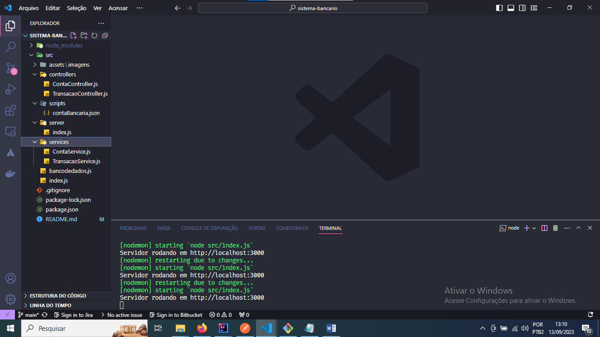

# API Sistema Bancário

 Projeto de estudo para criação de api RESTful, onde utilizo das seguinte tecnologias:

[](https://nodejs.org/en)
[](https://developer.mozilla.org/pt-BR/docs/Web/JavaScript)
[](https://expressjs.com/pt-br/)
[](https://code.visualstudio.com/)
[](https://www.postman.com/)
[](https://www.npmjs.com/)

[]()
[](https://www.linkedin.com/in/juniorbrandao/)

### Configurações para inicialização

- Você pode optar por clonar o projeto utilizando de git clone, no acesso github.com/junior-brandao/sistema-bancario.
- Utilize o VS CODE para abri-lo.
- Através do comando > npm install, baixe e instale as dependências do projeto.
- Após executar sua aplicação através do comando > npm run dev, a api estará rodando em <http://localhost:3000>.

## Testes e Documentação

   Através do Postman, crie as requisiçoes http para as rotas existentes.
   Obs: Você pode importar o script em: **`src/scripts/contaBancaria.json`**

## 1 - Visão geral do sistema
  
   O sistema deve criar uma API para um Sistema de Banco Digital.Será construida uma  RESTful API que permita:

- `Criar` conta bancária
  - Esse endpoint deverá criar uma conta bancária
- `Listar` contas bancárias
  - Esse endpoint deverá lista todas as contas bancárias existentes.
- `Atualizar` os dados do usuário da conta bancária
  - Esse endpoint deverá atualizar uma conta existente
- `Excluir` uma conta bancária
  - Esse endpoint deve excluir uma conta bancária existente.
- `Depósitar` em uma conta bancária
  - Esse endpoint deverá somar o valor do depósito ao saldo de uma conta válida e registrar essa transação.
- `Sacar` de uma conta bancária
  - Esse endpoint deverá realizar o saque de um valor em uma determinada conta bancária e registrar essa transação.
- `Transferir` valores entre contas bancárias
  - Esse endpoint deverá permitir a transferência de recursos (dinheiro) de uma conta bancária para outra e registrar essa transação.
- `Consultar` saldo da conta bancária
  - Esse endpoint deverá retornar o saldo de uma conta bancária.
- `Emitir` extrato bancário
  - Esse endpoint deverá listar as transações realizadas de uma conta específica.

### Persistências dos dados

  Os dados serão persistidos em memória, no objeto existente dentro do arquivo `bancodedados.js`. **Todas as transações e contas bancárias deverão ser inseridas dentro deste objeto, seguindo a estrutura que já existe.**

### Estrutura do objeto no arquivo `bancodedados.js`

```javascript
{
    banco: {
        nome: "Cubos Bank",
        numero: "123",
        agencia: "0001",
        senha: "Cubos123Bank",
    },
    contas: [
        // array de contas bancárias
    ],
    saques: [
        // array de saques
    ],
    depositos: [
        // array de depósitos
    ],
    transferencias: [
        // array de transferências
    ],
}
```

## 2 - Endpoints  

1. **CONTAS**

- #### `GET` {host}/contas?senha_banco=Cubos123Bank

- #### `POST` {host}/contas

- #### `PUT` {host}/contas/:numeroConta/usuario

- #### `DELETE` {host}/contas/:numeroConta

1. **TRANSAÇÕES**

- #### `POST` {host}/transacoes/depositar

- #### `POST` {host}/transacoes/sacar

- #### `POST` {host}/transacoes/transferir

- #### `GET` {host}/contas/saldo?numero_conta=123&senha=123

- #### `GET` {host}/contas/extrato?numero_conta=123&senha=123

## 3 - Script da Collection Postman

A collection **`Conta Bancária`** será encontrada em:
`src/scripts/contaBancaria.json`
. Importe através do postamn e faça uso.

## 4 - Protótipos de tela

#### Criando uma conta


#### Consultando contas cadastradas


#### Atualizando uma conta


#### Extrato de uma conta


## 6 - Estrutura de Arquivos



## 5 - Autor

#### E-mail: <edilson_brandaojunior@hotmail.com>

#### Linkedin: <https://www.linkedin.com/in/juniorbrandao/>
